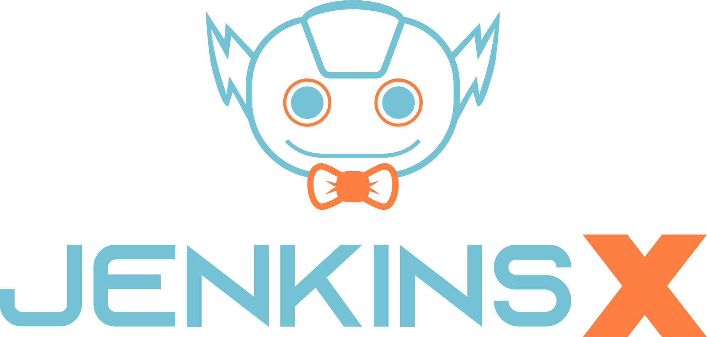

# Google Summer of Code 2022 - Jenkins X

On May 20, I got an email from google that I've been selected for the Google Summer of Code 2022, my mentor already told me that they've selected me few hours back, so that email was excepted, but the journey from January to May was a amazing experience, I already did 3 interns before this, but this is just different.

I'm planning on writing my experiences, and super excited to be the part of [Jenkins X Community](https://jenkins-x.io/community/). 
